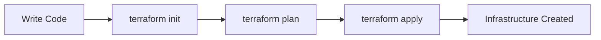

# 🚀 Terraform — Infrastructure as Code (IaC)


---

## 📌 Overview

**Terraform** is an open-source Infrastructure as Code (IaC) tool developed by **HashiCorp**. It allows you to define, provision, and manage cloud infrastructure using a **declarative configuration language (HCL)**.

With Terraform, infrastructure becomes **version-controlled, reusable, predictable, and automated**.

---

## ✨ Why Terraform?

✅ Cloud-agnostic (AWS, Azure, GCP, Kubernetes, etc.)  
✅ Declarative configuration (desired state)  
✅ Immutable infrastructure approach  
✅ Execution plan before applying changes  
✅ Easy rollback and change tracking  

---

## 🧱 Key Terraform Components

| Component | Description |
|---------|------------|
| **Provider** | Cloud or service (AWS, Azure, GCP) |
| **Resource** | Infrastructure object (EC2, S3, VPC) |
| **Module** | Reusable infrastructure code |
| **Variable** | Dynamic input values |
| **Output** | Display important values |
| **State** | Tracks real infrastructure |

---

## 📂 Project Structure (Best Practice)

```
terraform-project/
│── main.tf        # Core resources
│── provider.tf    # Provider configuration
│── variables.tf   # Input variables
│── outputs.tf     # Output values
│── terraform.tfvars
│── versions.tf    # Terraform & provider versions
│── modules/
│   └── vpc/
│       ├── main.tf
│       ├── variables.tf
│       └── outputs.tf
└── README.md
```

---

## ⚙️ Installation

```bash
# Ubuntu / Debian
sudo apt-get update && sudo apt-get install -y terraform

# Verify installation
terraform -version
```

---

## 🚀 Terraform Workflow



### 1️⃣ Initialize
```bash
terraform init
```

### 2️⃣ Plan
```bash
terraform plan
```

### 3️⃣ Apply
```bash
terraform apply
```

### 4️⃣ Destroy
```bash
terraform destroy
```

---

## 🧩 Example: Create an AWS EC2 Instance

```hcl
provider "aws" {
  region = "ap-south-1"
}

resource "aws_instance" "example" {
  ami           = "ami-0abcdef12345"
  instance_type = "t2.micro"

  tags = {
    Name = "Terraform-EC2"
  }
}
```

---

## 🔐 State Management Best Practices

✔ Use **remote backend** (S3 + DynamoDB)  
✔ Never commit `terraform.tfstate` to Git  
✔ Enable state locking  
✔ Separate environments (dev, stage, prod)

---

## 🌍 Environment Strategy

```
/dev
/prod
/stage
```

Or use **workspaces**:
```bash
terraform workspace new dev
terraform workspace select prod
```

---

## 🛡️ Security Best Practices

🔒 Use IAM roles instead of access keys  
🔒 Store secrets in AWS Secrets Manager / Vault  
🔒 Apply least privilege principle  
🔒 Enable version locking

---

## 📈 Terraform in Production

✔ CI/CD integration (GitHub Actions, Jenkins)  
✔ Code review via Pull Requests  
✔ Automated plan & apply  
✔ Policy as Code (OPA / Sentinel)

---

## 🧪 Useful Terraform Commands

```bash
terraform fmt        # Format code
terraform validate   # Validate configuration
terraform show       # Show state
terraform graph      # Dependency graph
```

---

## 📚 Learning Resources

- Terraform Official Docs
- HashiCorp Learn
- Terraform Registry

---

## 👨‍💻 Author

**Swapnil**  
DevOps | Cloud | Terraform | AWS

---

⭐ *If you found this useful, don’t forget to star the repository!*

